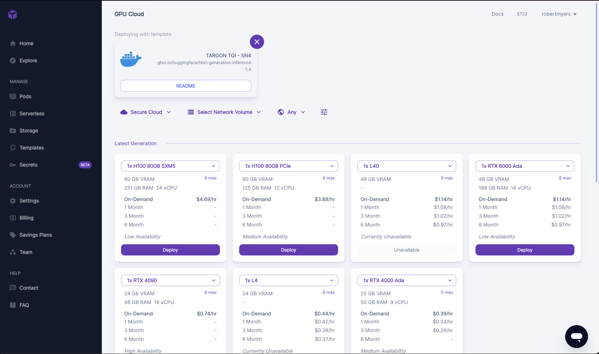
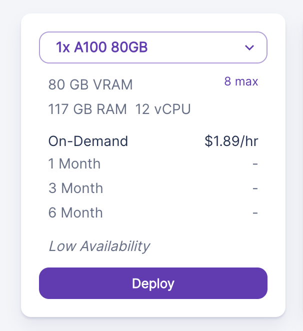
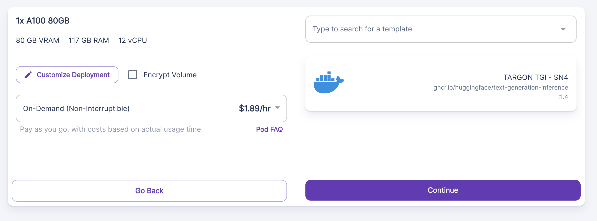
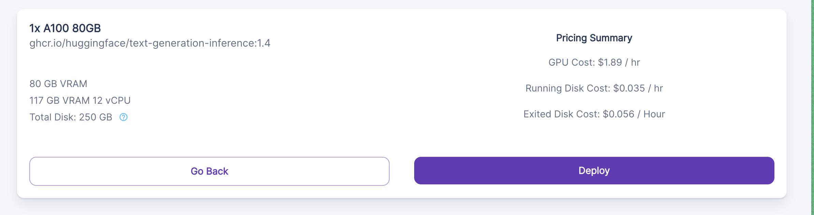
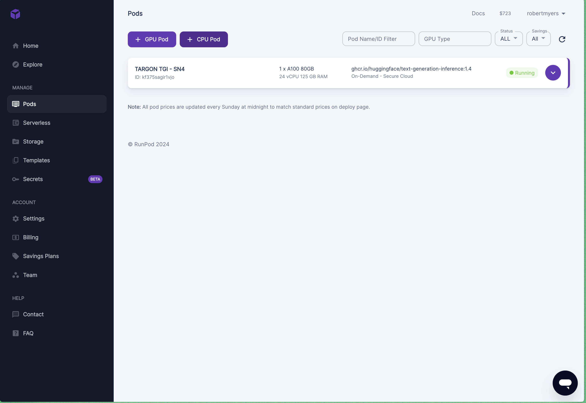
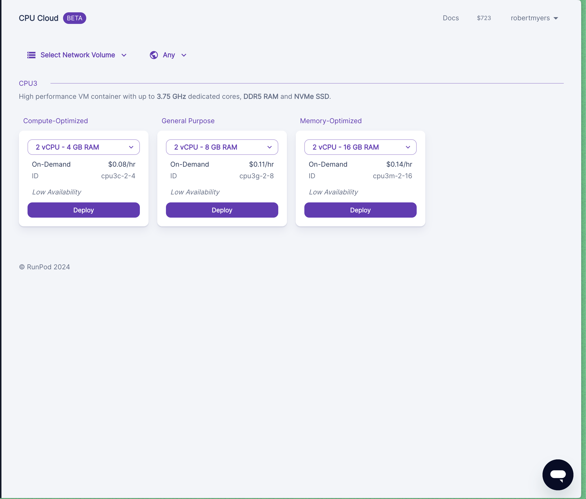
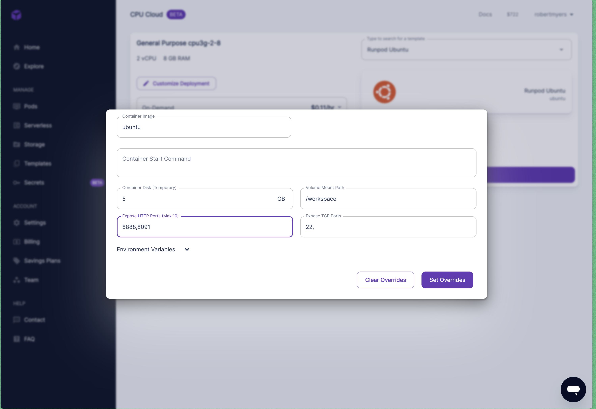

# Running a Prover on RUNPOD

## Introduction
Utilizing Runpod to run a prover offers a streamlined and effective solution for leveraging cloud-based resources. This section details the process of setting up and deploying a prover on Runpod, assuming that you have already created an account and have sufficient funds.

## INSTALLATION

### Create TGI Instance
Manifold has created a template for running TGI on Runpod. You can find the template [here](https://runpod.io/gsc?template=gh1lamgsuz&ref=u908wzaw). Click on the link and you will be redirected to the Runpod website. Once you have logged in, you will be able to create a new instance using the template. The page should look like this once you click the link.

Scroll down and seklect A100 as the GPU type. Then click on the "Deploy" button. You will be redirected to the instance page where you can see the status of your instance. It should look like this.

Then select continue

then select "Deploy"

Once the container is finished building you have set up TGI.

### Set up Prover

Once you have set up TGI, you can now set up the prover. 

Navigate to Pods in the side bar and select + CPU Pod.

Once you have selected the + CPU Pod, you will be redirected to the page where you can set up the CPU pod.

customize the pod to add the prover axon port and then click "Deploy". Once the container is finished building you have set up the prover and follow the readme normally.

