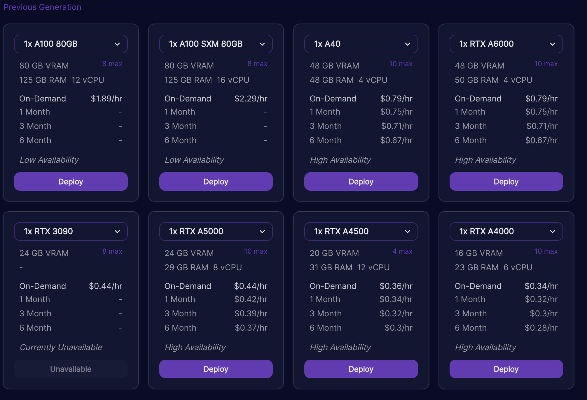

# Running on Runpod

## Table of Contents
1. [Introduction](#introduction)
2. [Running a Verifier on Runpod](#running-on-runpod)
3. [Running a Prover on Runpod](#running-on-runpod-with-a-custom-configuration)

## Introduction 
Runpod is a service that allows you to run a verifier or prover on a remote machine. It is a convenient way to run a verifier or prover. It is also useful for running a verifier or prover on a machine with more resources than your local machine.

In order to run a verifier or prover on Runpod, You will need to run multiple containers and have them linked to each other.

## Running a Verifier on Runpod 

To run a verifier on Runpod, This assumes you have logged in and funded your account. 

## Step 1: Navigate to the machine you would like to rent
First, navigate to the machine you would like to rent on the [Runpod website](https://runpod.io). 

## Step 2: Navigate to the configuration page
Next, navigate to the configuration page by clicking the "Customize Deployment" button.

## Step 3: Configure to run the verifier

