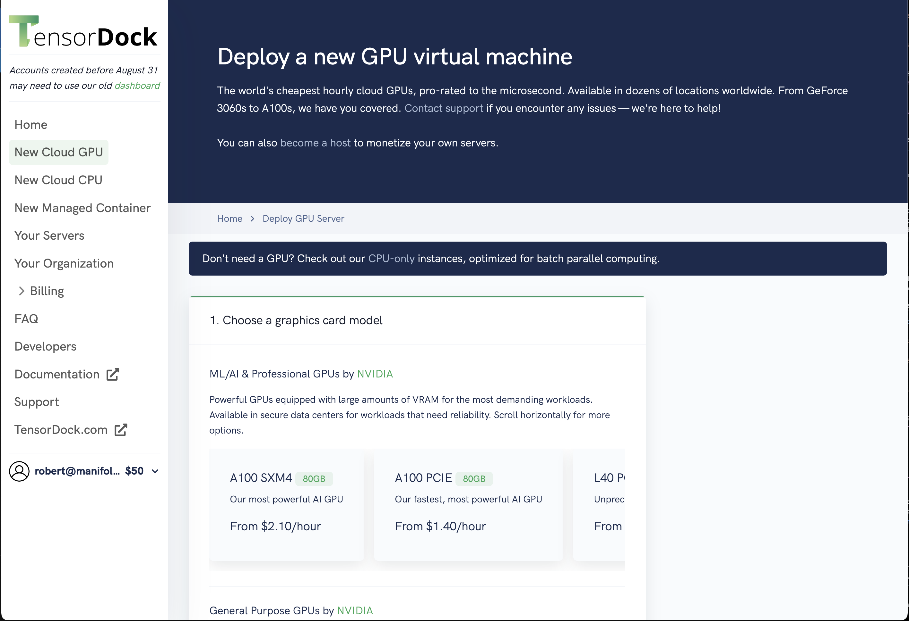
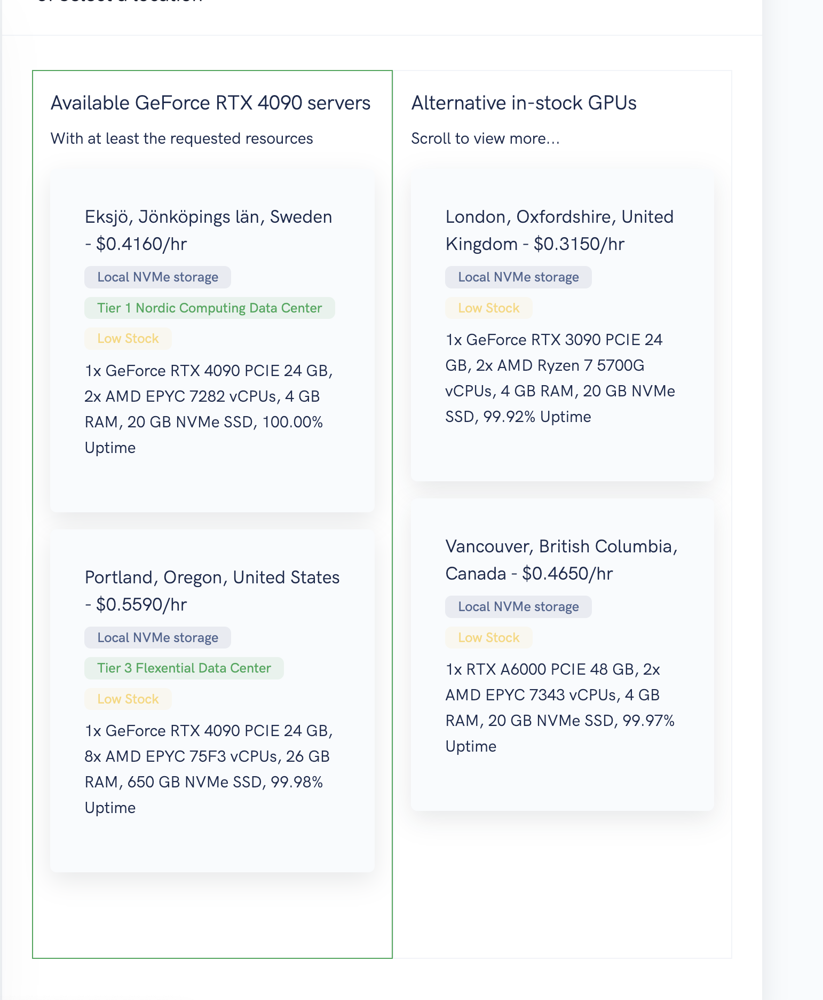
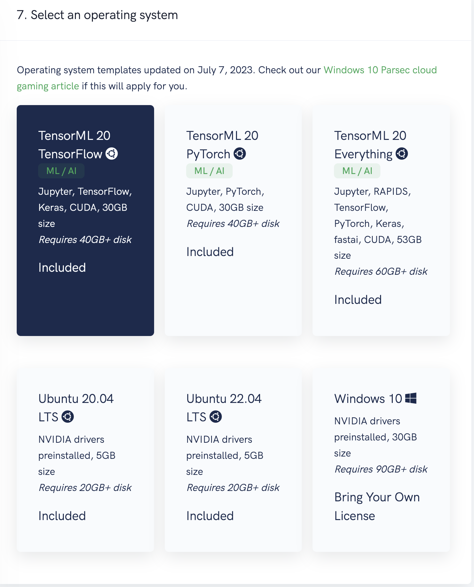
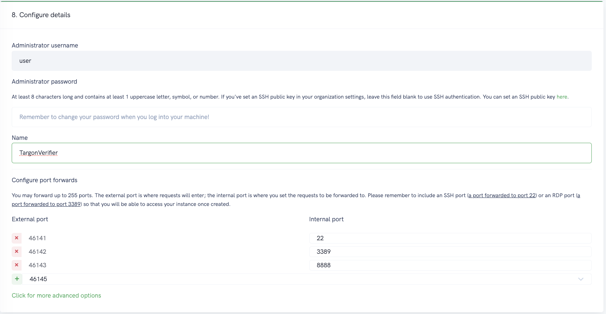

# Running on TensorDock
Utilizing Tensordock to run a verifier offers a streamlined and effective solution for leveraging cloud-based resources. This section details the process of setting up and deploying a verifier on Tensordock, assuming that you have already created an account and have sufficient funds.

## Table of Contents
1. [Running a Verifier on Tensordock](#running-a-verifier-on-tensordock)
2. [Running a Prover on Tensordock](#running-a-prover-on-tensordock)

## Running a Verifier on Tensordock 

To run a verifier on Tensordock, This assumes you have logged in and funded your account. 

## Step 1: Navigate to the machine you would like to rent
The first step in running your verifier on Tensordock is choosing an appropriate machine. Navigate to the Tensordock deployment page to view available options. For this guide, we'll be focusing on the A100 SXM4 machine, ideal for demanding tasks due to its robust performance capabilities. It's crucial to select a GPU with a minimum VRAM of 24GB. Suitable choices include models like the A5000 or the high-performance 4090/3090 GPUs.

## Step 2: Select the machine location
After selecting your machine, the next step is to choose its physical location. This decision can impact factors such as latency and data residency. Tensordock offers various location options, such as Sweden or Portland, allowing you to choose the one closest to your geographical location or your target audience.

## Step 3: Select the Operating System
The choice of operating system is crucial for compatibility and performance. Tensordock provides several OS options, tailored to different needs. For our purposes, TensorML 20.04 is an excellent choice, offering a balance between stability and access to the latest features. This OS is particularly optimized for machine learning and related computational tasks.

## Step 4: Select the machine details
This step involves customizing the specifics of your machine. You can configure details like SSH keys for secure access, machine name for easy identification, and port forwarding settings for network access. While defaults work well for most situations, you may tailor these settings to suit your specific needs or preferences.

## Step 5: Deployment 
With all configurations set, click the Deploy button to initiate the deployment of your machine. The process might take a few moments, during which Tensordock prepares and provisions your selected machine. Once the deployment is complete, you will receive a notification, and your machine will be ready for use.

## Next Steps 
After completing these steps, your machine on Tensordock is ready for the verifier to be run. Follow the subsequent instructions specific to the verifier setup and execution to begin your tasks on the cloud.

